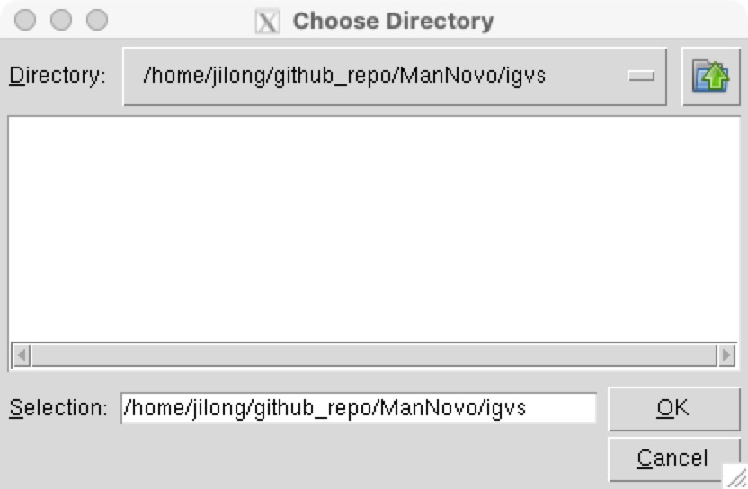

# ManNovo
A python program for recording manual curation of de novo germline mutation candidates within each trio
> ### Manual Curation in Germline Mutation Calling
> For mutation rate estimation, it is most direct to count the de novo germline mutation in trio data. It is quite often that manucal curation according to bam files is still needed for candidate mutation sites found by different mutation calling programs. Hence, we can validate the correctness of the called de novo mutation by the calling pipeline.

The python program was made for adding manual curation of candidate de novo mutation sites that are presented as IGV snapshot figures. See example figures in ``. With the program you can do a manual de novo mutation curation competition with the colleauges.

### Current function in program includes:
- Load a series of IGV figures from a folder
- Record the manual curation - load, add, change, cancel the curation results
- Browse the manual curation results
- Check manual curation progress

## Usage of the program

### 1.Set a user ID.
At the beginning of the program, you will be asked to give a user ID. The ID will be recorded as an identifier of who is giving the curation result.

### 2.Select the folder where figures to be curated are in.
After ID is given, now you can select the folder containing the figures to be curated. Normally, each trio has its own folder. By default, the output file recoding the results will be name after this folder name concatenating the user ID. Here the example folder `./igvs`

### 3.Select your curation result and submit.
Now you will see the first figure shown in the middle. Select `yes`,`no`,or `Uncertain` for the option "Is it de novo mutation?", select `Mother`,`Father`, or `Uncertain` for the option "What is the source of mutation?". At last, by clicking `submit`, your curation result for this figure will be recorded and next figure will be shown.

### 4.Browse the figures and curation results.
By `Last Figure`, `Next Figure`,`Go to Figure Number` button, you can browser around the figures and their relevant curation results. If you wish to change or cancel the current curation result, do `Submit` again or `Cancel Curation`. `Plot Curation` will generate a meshgrid plot in bar showing the curation result of all figures, where red codes for "False de novo mutation", blue codes for "True de novo mutation" and grey codes for "Not curated yet".

### 5.Print out your curation results.
Once you have finished all your curation (maybe not finished), click `Print out` and a tsv file named with `"Figure folder name"_"User ID"` will be created or updated with all the curations have been done. If the output file from `Print out` option has already exist befor opening the program, the previous curation results will be loaded automatically. You may click on `Go to next uncurated` button to continue the unfinished curation task. Remember to `Print out` again after your new curation to save your new curation updates.

